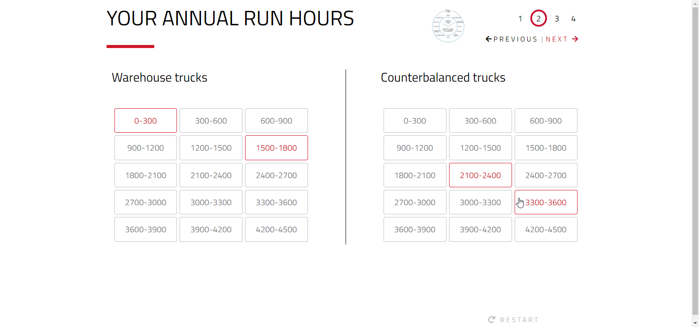
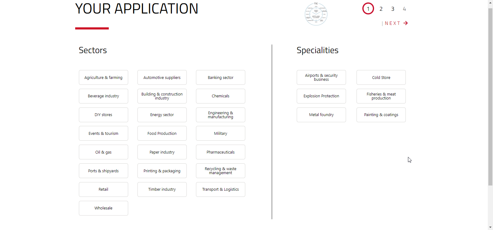
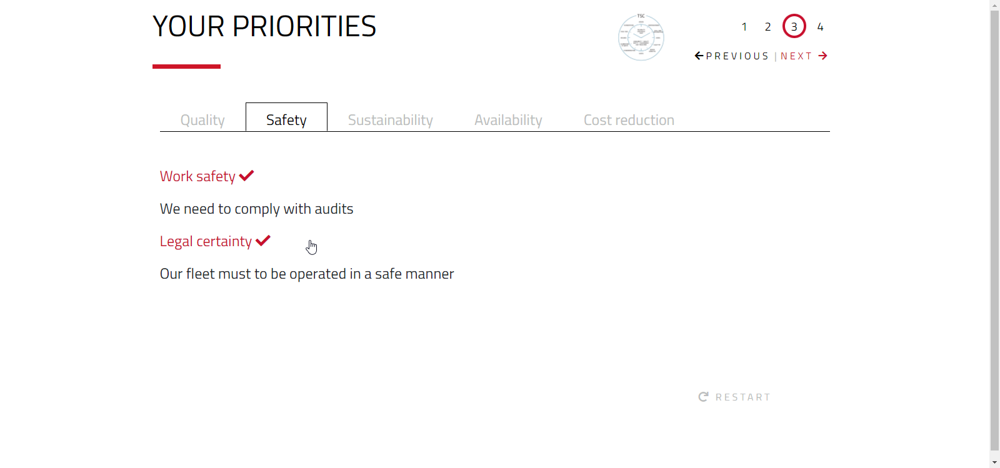
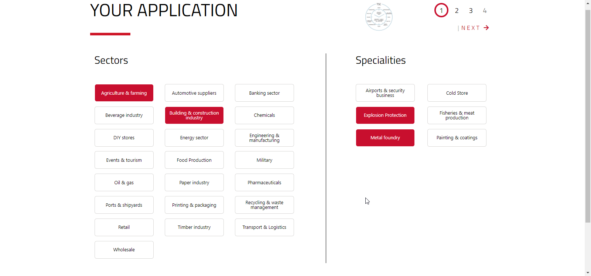
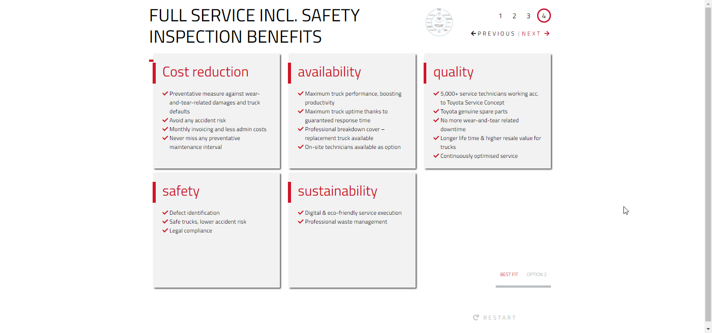
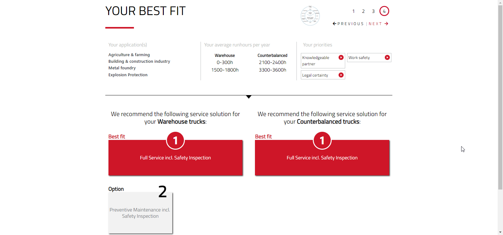
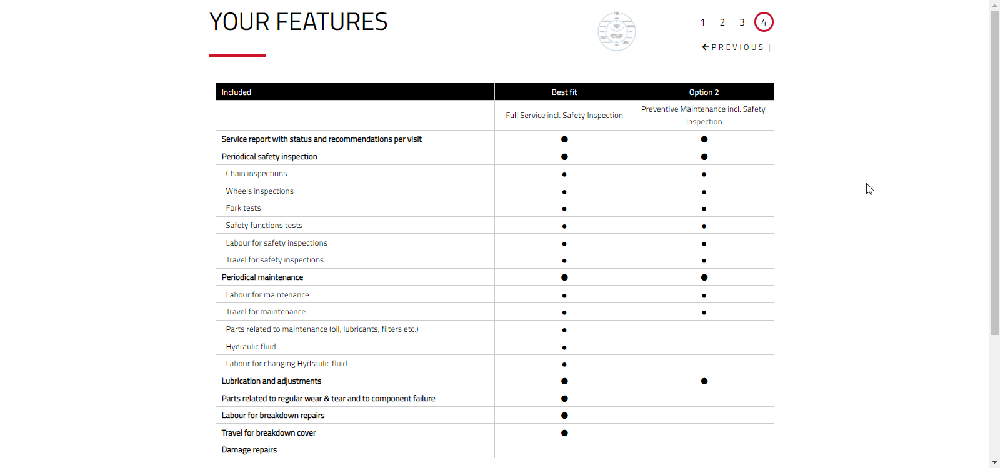
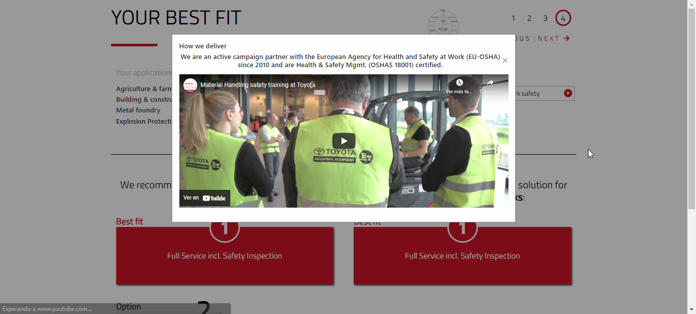

# ServiceCompassToyota

## System developed for the Toyota company, which provides a series of solutions, features and benefits based on a series of answers given by the user.

## The system evaluates each response to generate a specific solution, each variation is taken into account in a table of values, and then studied to provide an optimal solution to the customer, this solution is accompanied by benefits and features.

## Development technologies

- AngularJs
- Css
- Bootstrap

### It has 3 main sections of answers

1. Your Application: This section is in charge of collecting which sector the problem is addressed to.
2. Your Annual Run Hours: How many hours approximately within a specific range you drive two types of vehicles
   1. WareHouse Trucks
   2. Counterbalanced Trucks
3. Your Priorities: What are your priorities, in this section the user is shown a series of questions, which should be checked based on the situation.
4. Final Solution: There are several scenarios where different solutions can be shown to the user in two specific sectors, maximum 3 solutions per sector and minimum 1.
   1. WareHouse Trucks
   2. Counterbalanced Trucks
   3. This final screen shows the user the options that have been previously checked.
5. Each solution sector has the benefits of each specific solution.
6. Each solution sector has a table of characteristics.

### This system was developed to be integrated in a mother system, as a SubSystem.

### It has multi-language functionality in several languages, all options and solutions vary depending on the language that is selected.

| -                                                                          | -                                                                                        |
| -------------------------------------------------------------------------- | ---------------------------------------------------------------------------------------- |
|            |              |
|  |  |
|        |                      |
|      |                    |

## **Note: It is not possible to upload the system code to a public repository due to internal company policies.**
